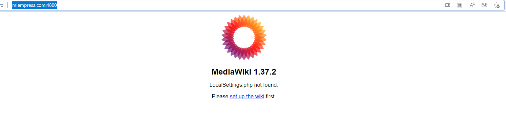
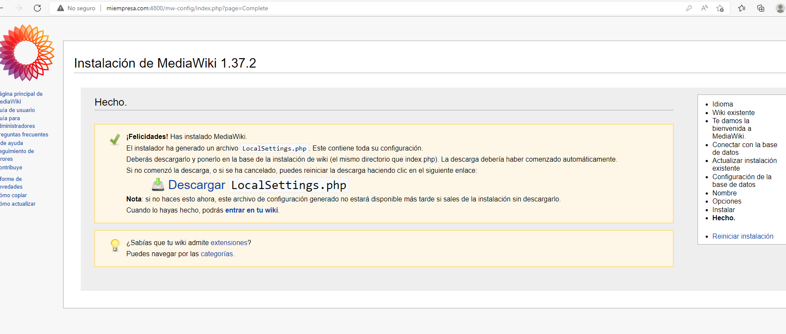
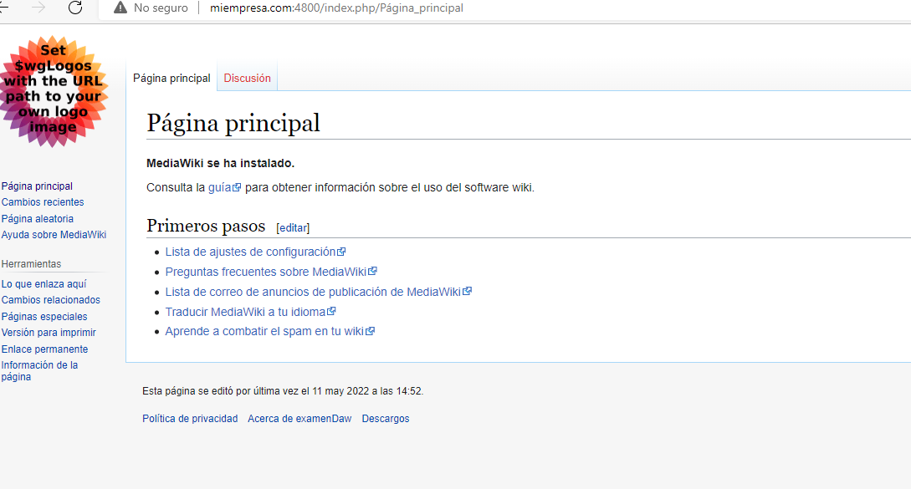
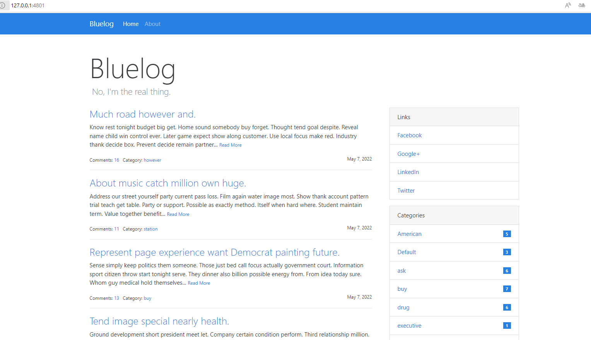

# Preparamos el entorno

Creamos una maquina virtual con ubuntu

```bash
#!/usr/bin/env bash
apt-get update
apt-get install -y apache2
if ! [ -L /var/www ]; then
rm -rf /var/www
ln -fs /vagrant /var/www
fi
```

Dentro del vagrant file añadimos la provision y la apertura de los puertos

```
config.vm.provision :shell, path: "bootstrap.sh"
config.vm.network :forwarded_port, guest: 80, host: 4800
config.vm.network :forwarded_port, guest: 8080, host: 4801
```

# Creacion pagina de incicio

Creamos un index.html con el codigo básico para que pueda ir tanto a la wiki como al blog

```bash
<!DOCTYPE html>
<html>
    <head>
        <title>Examen David Pastor Puyuelo</title>
    </head>
    <body>
        <h1>
            Indice de paginas
        </h1>
        
        <a href="http://miempresa.com:4800/"> Wiki </a> </br>
        <a href="http://blog.miempresa.com:4800/"> Blog </a>

    </body>
</html>
```

Incorporar la direccion de acceso en el fichero C:\Windows\System32\drivers\etc

```
miempresa.com
blog.miempresa.com
```

# Instalar wiki empresarial


Instalamos todos los requerimientos de una vez

`sudo apt-get install php php-apcu php-intl php-mbstring php-xml php-mysql php-calendar mariadb-server apache2`

Descargamos la versión del mediawiki

`wget https://releases.wikimedia.org/mediawiki/1.37/mediawiki-1.37.2.tar.gz`

Descomprimimos

`sudo tar xf mediawiki-1.37.2.tar.gz -C /var/www/html/`

Renombramos la carpeta de destino de  /var/www/html/mediawiki-1.37.2/ por wiki

Entramos en mariadb y creamos la base de datos

```
mysql -u root -p
create database my_wiki character set utf8mb4 collate utf8mb4_unicode_ci;
create user 'mediawiki'@'%' identified  by 'password';
grant all on my_wiki.* TO 'mediawiki'@'%';
flush privilieges;
```

Instalamos extensiones de php

```
sudo apt install -y php-apcu php-gd php-imagick php-intl php-mbstring php-xml
sudo apt install -y php7.3-apcu php7.3-gd php7.3-imagick php7.3-intl php7.3-mbstring php7.3-xml
```

Movemos la carpeta /var/www/html/wiki a /var/www/wiki

Creamos el virtualhost para la wiki

- Nota. No es buena practica dejar ahí los archivos de log, pero los pongo para tenerlos de facil acceso.

`nano /etc/apache2/sites-available/wiki.conf`

```
<VirtualHost *:80>
 ServerAdmin webmaster@wiki.server.com
 DocumentRoot /var/www/wiki
 ServerName miempresa.com
 ServerAlias http://miempresa.com

 <Directory />
    Options FollowSymLinks
    AllowOverride None
 </Directory>

 <Directory /var/www/wiki>
    AllowOverride All
 </Directory>

 ErrorLog /var/www/wiki/error.log
 CustomLog /var/www/wiki/access.log combined

</VirtualHost>
```

Y por ultimo activamos el vitualhost y recargamos apache

```
a2enite wiki.conf
systemctl restart apache2
```

Entramos en el navegador para terminar la instlación.

`http://miempresa.com:4800/`








# Instalar blog

Nos movemos a la carpet /home/vagrant

Clonamos el repositorio

`git clone https://github.com/lmorillas/bluelog.git`


Instalams python

```apt install python3.8-venv
apt update && sudo apt install python3-pip
```

Creamos y activamos el virual end y sus dependencias dentro de la carpeta bluelog

```
python3 -m venv env  # create env
source env/bin/activate  
pip install -r requirements.txt
python3 -m venv env
```

Instalamos la aplicacion de pythn y el servidor web

```
pip install flask lxml
pip install gunicorn
```

Ponemos en marcha la app y validamos que funciona el servidor

`gunicorn wsgi:app -b :8080`




Activamos modulos necesarios de apache para crear el proxy inverso

`a2enmod proxy proxy_http`

Creamos el virtulhost para poder acceder desde blog.miempresa.com y que actue apache como proxy inverso. También configuramos en el virtual host para que el servidor sea gunicorn pero como servidor de recursos estaticos sea apache

`nano /etc/apache2/sites-available/blog.conf`

```
<VirtualHost *:80>
 ServerAdmin webmaster@blog.server.com
 DocumentRoot /home/vagrant/bluelog
 ServerName blog.miempresa.com
 ServerAlias http://blog.miempresa.com.com

 ProxyPass /static/ !
 ProxyPass / http://localhost:8080/
 Alias /static/ /home/vagrant/bluelog/static

 <Directory />
    Options FollowSymLinks
    AllowOverride None
 </Directory>

 <Directory /home/vagrant/bluelog>
    AllowOverride All
 </Directory>

 ErrorLog /home/vagrant/bluelog/error.log
 CustomLog /home/vagrant/bluelog/access.log combined

</VirtualHost>
```

Y por ultimo activamos el vitualhost y recargamos apache

```
a2enite blog.conf
systemctl restart apache2
```

Para hacer que el servidor gunicorn arranque de inicio y no haya que arrancarlo manualmente, cremos un servicio

`nano /etc/systemd/system/autorun.service`

```
[Unit]
Description=Gunicorn service

[Service]
User=vagrant
Group=vagrant
WorkingDirectory=/home/vagrant/bluelog

ExcecStart=/home/vagrant/bluelog/env/bin/gunicorn --workers=4 --bind 127.0.0.0:8080 wsgi:app

[Install]
WantedBy=multi-user.target
```

Activamos el servicio

```
systemctl enable autorun
systemctl start autorun
```